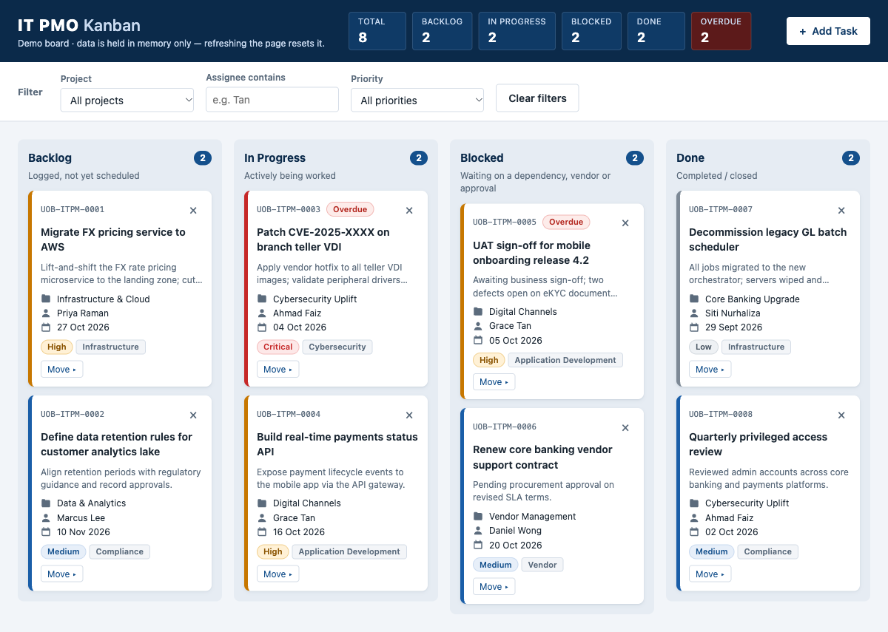

# IT PMO Kanban

[](https://github.com/chinazur/kanban5/actions/workflows/ci.yml)
[](https://github.com/chinazur/kanban5/actions/workflows/pages.yml)

A Kanban board for the internal IT PMO of a fictitious bank, built as a demo and training tool. The whole app is one `index.html` file in vanilla HTML, CSS and JavaScript. It has no frameworks, no build step and no external resources, and it runs straight from the file system.

**Live demo:** https://chinazur.github.io/kanban5/

> Demo only. Data is held in memory, so refreshing the page resets the board to its seed data.



## Features

- **Four columns:** Backlog, In Progress, Blocked and Done.
- **Add Task form** with inline validation for title, description, project or workstream, category, assignee, priority, due date and status.
- **Move cards** by drag and drop, or with each card's keyboard-accessible Move menu.
- **Delete cards** with an inline "Delete? Yes / No" confirmation on the card itself.
- **Filters** by project, assignee (text search) and priority. Column badges show `shown / total` while a filter is on.
- **Live header summary** of task counts, which always counts the unfiltered board.
- **Overdue highlighting** for tasks past their due date that aren't Done. Seed dates are set relative to today, so there are always some overdue examples.
- **Task IDs** in the `UOB-ITPM-####` format.
- **Optional email notification** for each new task via [FormSubmit](https://formsubmit.co), with a "Sending…" state, a 15 second timeout and a warning toast if it fails.
- **Accessible:** focus is trapped in the modal and restored after re-renders, toasts are announced politely to screen readers, and fields have labels and error descriptions.

## Tech stack

- HTML5, CSS custom properties, vanilla JavaScript (ES2017+)
- Native HTML5 drag and drop
- System font stack and inline SVG/Unicode icons
- GitHub Actions for CI and GitHub Pages deployment

## Getting started

### Prerequisites

A modern web browser. Nothing else needs installing.

### Run locally

```bash
git clone https://github.com/chinazur/kanban5.git
cd kanban5
open index.html        # macOS. On Windows/Linux, double-click the file.
```

### Configuration

Email notifications for new tasks are optional. To turn them on, set the address in `FORMSUBMIT_ENDPOINT` at the top of the `<script>` block in `index.html`:

```js
const FORMSUBMIT_ENDPOINT = "https://formsubmit.co/ajax/YOUR_EMAIL@example.com";
```

FormSubmit needs a **one-time activation**. The first submission to a new address sends a confirmation email, and nothing is delivered until you click its link. Note that the address is visible in the public page source.

### Checks

There's no build or test tooling. CI runs these checks, and you can run them locally too:

```bash
# JavaScript syntax check
sed -n '/<script>/,/<\/script>/p' index.html | sed '1d;$d' > /tmp/app.js && node --check /tmp/app.js

# Constraint check (should print nothing)
grep -nE 'localStorage|sessionStorage|indexedDB|document\.cookie|alert\(|confirm\(|!important|<link|src="http' index.html
```

## Project structure

```
.
├── index.html                 # The whole app: markup, <style> and <script>
├── CLAUDE.md                  # Architecture notes and project constraints
├── docs/screenshot.png        # Screenshot used in this README
└── .github/workflows/
    ├── ci.yml                 # Syntax, constraint and secret-scan checks
    └── pages.yml              # Deploys index.html to GitHub Pages
```

Inside the script, `state` is the single source of truth. Every change goes through `addTask`, `moveTask`, `deleteTask` or `setUi`, and then `renderBoard()` rebuilds the view. See [CLAUDE.md](CLAUDE.md) for the full architecture.

## CI/CD

- **CI** (`ci.yml`) runs on every push and pull request to `main`. It checks the JavaScript syntax, enforces the project constraints (no storage APIs, no `alert`/`confirm`, no `!important`, no external resources), and scans the repo history for secrets with Gitleaks.
- **Deploy** (`pages.yml`) runs on every push to `main`, or manually. It publishes `index.html` to GitHub Pages.

## Contributing

Issues and pull requests are welcome. Please keep to the constraints in [CLAUDE.md](CLAUDE.md): a single file, vanilla JS, no external resources, no persistence. Make sure CI passes.

## License

No license has been specified yet. All rights reserved by the author until one is added.

## Disclaimer

This is a fictitious demo. It isn't affiliated with, endorsed by or meant to imitate any real bank or its systems.
